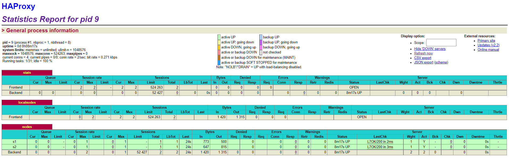
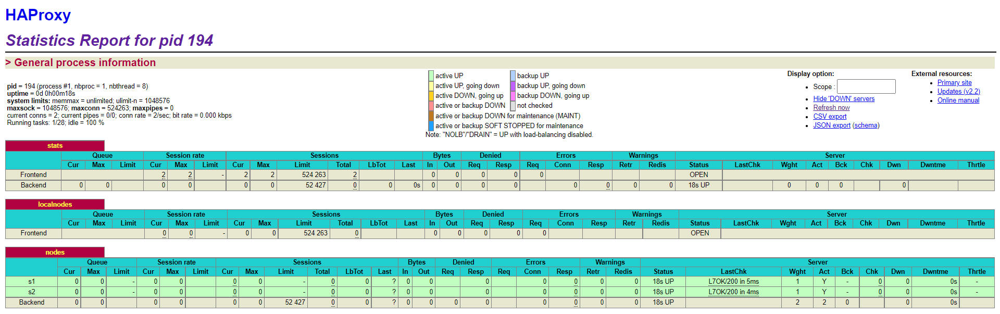
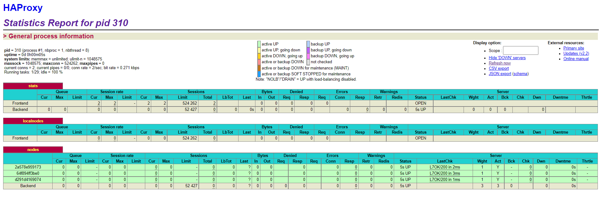

# Report of AIT Lab04 - Docker

**Authors : Jean-Luc Blanc, Dylan Canton, Christian Zaccaria**


### Table of content

---

**Introduction**  
**Task 0 : Identify issues and install the tools**  
		M1  
		M2  
		M3  
		M4  
		M5  
		M6  
		Deliverables of Task 0  
			Screenshot HAProxy  
			Repository URL  
**Task 1 : Add a process supervisor to run several processes**  
		Deliverables of Task 1  
			Screenshot HAProxy  
**Task 2 : Add a tool to manage membership in the web server cluster**  
		Answer problem with current solution  
		GOSSIP protocol used in SERF  
**Task 3 : React to membership changes**  
		Deliverables of Task 3  
**Task 4 : Use a template engine to easily generate configuration files**  
		Deliverables of Task 4  
			Q1  
			Q2  
			Q3  
			Q4  
**Task 5 : Generate a new load balancer configuration when membership changes**  
		Deliverables of Task 5  
			Q1  
			Q2  
			Q3  
			Q4  
**Task 6 : Make the load balancer automatically reload the new configuration**  
		Deliverables of Task 6  
**Difficulties encountered**  
**Conclusion**  

---


## Introduction

This laboratory allows you to set up a cluster of servers with Docker containers. HAProxy  will then be added in order to manage the containers and the configuration of the cluster.


## Task 0 : Identify issues and install the tools

### M1

*Do you think we can use the current solution for a production environment? What are the main problems when deploying it in a production environment?*

> No, our solution is static and non-scalable. Which means we have to update it manually each time we want to add new nodes when a server crashes. We need to automatize this in a real case.

### M2

*Describe what you need to do to add new `webapp` container to the infrastructure. Give the exact steps of what you have to do without modifiying the way the things are done. Hint: You probably have to modify some configuration and script files in a Docker image.*

> First we create a new webapp container in the docker-compose.yml file, then we modify the HAProxy configuration file to add our new node, then we rebuild everything in order to load our changes

### M3

*Based on your previous answers, you have detected some issues in the current solution. Now propose a better approach at a high level.*

> Implement a dynamic configuration for HAProxy so that every time we add a new node, the configuration is updated automatically (agent running on background and send IP address to modify on configuration)

### M4

*You probably noticed that the list of web application nodes is hardcoded in the load balancer configuration. How can we manage the web app nodes in a more dynamic fashion?*

> We need a service discovery tool in order to tell us which node is up and then update the HAProxy accordingly

### M5

*In the physical or virtual machines of a typical infrastructure we tend to have not only one main process (like the web server or the load balancer) running, but a few additional processes on the side to perform management tasks.*

*For example to monitor the distributed system as a whole it is common to collect in one centralized place all the logs produced by the different machines. Therefore we need a process running on each machine that will forward the logs to the central place. (We could also imagine a central tool that reaches out to each machine to gather the logs. That's a push vs. pull problem.) It is quite common to see a push mechanism used for this kind of task.*

*Do you think our current solution is able to run additional management processes beside the main web server / load balancer process in a container? If no, what is missing / required to reach the goal? If yes, how to proceed to run for example a log forwarding process?*

> Right now each container have only one service running, if we want to have multiple services on a container we need to have a process that would run multiple services for us.

### M6

*In our current solution, although the load balancer configuration is changing dynamically, it doesn't follow dynamically the configuration of our distributed system when web servers are added or removed. If we take a closer look at the `run.sh` script, we see two calls to `sed` which will replace two lines in the `haproxy.cfg` configuration file just before we start `haproxy`. You clearly see that the configuration file has two lines and the script will replace these two lines.*

*What happens if we add more web server nodes? Do you think it is really dynamic? It's far away from being a dynamic configuration. Can you propose a solution to solve this?*

> Every time we add a new server node, we will have to modify the HAProxy configuration file, this is not dynamic. In order to make it dynamic we would require to loop through the list of nodes and update the HAProxy configuration file automatically every time we add a new node. A template engine could do that.

### Deliverables of Task 0 

#### Screenshot HAProxy

*Take a screenshot of the stats page of HAProxy at [http://192.168.42.42:1936](http://192.168.42.42:1936/). You should see your backend nodes.*



#### Repository URL

*Give the URL of your repository URL in the lab report*

Repository URL : https://github.com/Cantondy/Teaching-HEIGVD-AIT-2020-Labo-Docker

---


## Task 1 : Add a process supervisor to run several processes

### Deliverables of Task 1

#### Screenshot HAProxy

*Take a screenshot of the stats page of HAProxy at [http://192.168.42.42:1936](http://192.168.42.42:1936/). You should see your backend nodes. It should be really similar to the screenshot of the previous task.*



> In this task we installed "s6" which is a process supervisor that will help us run multiple services on one container. We spent the task updating the dockfile and run scripts of the containers.
>
> No particular difficulties have arisen.

---


## Task 2 : Add a tool to manage membership in the web server cluster

### Answer problem with current solution

> Our solution is still not dynamic since it isn't yet possible to manage new nodes, this would require a script whose job would be to add the nodes to the cluster

### GOSSIP protocol used in `SERF`

> `Serf` is a cluster management and failure detection tool. It allows you to create a cluster with all its nodes so that they can communicate with each other. All this is done through the serf agent installed on each node, which allows the latter to be notified of the arrival and departure of nodes in the cluster.
>
> It can also detect failed nodes within seconds, notify the rest of the cluster and run custom management scripts to handle these events.
>
> `Serf` can also propagate custom events and queries to the cluster. These can be used to trigger deployments or propagate configurations.
>
> `GOSSIP` is a peer-to-peer protocol to send information over all the network's nodes in a broadcast fashion. This is used to maintain HAProxy's catalog of nodes. As a different solution, we could use Consul who also uses `GOSSIP` and works in a similar way than Serf but posses additional features like service discovery.

Other Solutions :

- Consul
  - Etcd
- Apache ZooKeeper

Sources : 

- https://www.serf.io/intro/index.html
- https://www.serf.io/docs/internals/gossip.html
- https://devopscube.com/open-source-service-discovery/

---


## Task 3 : React to membership changes

### Deliverables of Task 3

*Provide the docker log output for each of the containers: `ha`, `s1` and `s2`. Put your logs in the `logs` directory you created in the previous task.*

> See the `logs` folder

*Provide the logs from the `ha` container gathered directly from the `/var/log/serf.log` file present in the container. Put the logs in the `logs` directory in your repo.*

> See the `logs` folder

---


## Task 4 : Use a template engine to easily generate configuration files

### Deliverables of Task 4

#### Q1

*You probably noticed when we added `xz-utils`, we have to rebuild the whole image which took some time. What can we do to mitigate that? Take a look at the Docker documentation on [image layers](https://docs.docker.com/engine/userguide/storagedriver/imagesandcontainers/#images-and-layers). Tell us about the pros and cons to merge as much as possible of the command. In other words, compare:*

```
RUN command 1
RUN command 2
RUN command 3
```

*vs.*

```
RUN command 1 && command 2 && command 3
```

>By doing only 1 command at each line, we save time in the case of having to re-execute only the last one since an image is created at each command. 
>
>By doing all the commands in 1 line allows us to not have any temporary images and save some storage space, this is better if we want to simply save up space.

*There are also some articles about techniques to reduce the image size. Try to find them. They are talking about `squashing` or `flattening` images.*

> http://jasonwilder.com/blog/2014/08/19/squashing-docker-images/ 
>
> https://betterprogramming.pub/how-to-improve-docker-image-size-with-layers-3ad62be0da9b

#### Q2

*Propose a different approach to architecture our images to be able to reuse as much as possible what we have done. Your proposition should also try to avoid as much as possible repetitions between your images.*

>  By using image inheritance with the FROM keyword in the dockerfile. We could have a basic image with all common things between NodeJS and HAProxy and then 2 small images with the specificity of each.

#### Q3

*Provide the `/tmp/haproxy.cfg` file generated in the `ha` container after each step. Place the output into the `logs` folder like you already did for the Docker logs in the previous tasks. Three files are expected.*

*In addition, provide a log file containing the output of the `docker ps` console and another file (per container) with `docker inspect <container>`. Four files are expected.*

> See the `logs` folder task.

#### Q4

*Based on the three output files you have collected, what can you say about the way we generate it? What is the problem if any?*

> Instead of adding a new line in the file each time a node joins the cluster, we overwrite it, which poses an issue since every time we add a new node we have to check the file manually in order to get the correct entry.

---


## Task 5 : Generate a new load balancer configuration when membership changes

### Deliverables of Task 5

#### Q1

*Provide the file `/usr/local/etc/haproxy/haproxy.cfg` generated in the `ha` container after each step. Three files are expected.*

*In addition, provide a log file containing the output of the `docker ps` console and another file (per container) with `docker inspect <container>`. Four files are expected.*

> File of configuration are on `haproxy` folder and logs on `logs` folder task.

#### Q2

*Provide the list of files from the `/nodes` folder inside the `ha` container. One file expected with the command output.*

> Logs are on `logs` folder task.

#### Q3

*Provide the configuration file after you stopped one container and the list of nodes present in the `/nodes` folder. One file expected with the command output. Two files are expected.*

*In addition, provide a log file containing the output of the `docker ps` console. One file expected.*

> File of configuration are on `haproxy` folder and logs on `logs` folder task.

#### Q4

*(Optional:) Propose a different approach to manage the list of backend nodes. You do not need to implement it. You can also propose your own tools or the ones you discovered online. In that case, do not forget to cite your references.*

> We can use Consul for service discovery and manage the list of backend nodes. It keeps the list of alive nodes up to date and it is also used for load balancing between the backend nodes

---


## Task 6 : Make the load balancer automatically reload the new configuration

### Deliverables of Task 6

*Take a screenshots of the HAProxy stat page showing more than 2 web applications running. Additional screenshots are welcome to see a sequence of experimentations like shutting down a node and starting more nodes.*

*Also provide the output of `docker ps` in a log file. At least one file is expected. You can provide one output per step of your experimentation according to your screenshots.*

*Give your own feelings about the final solution. Propose improvements or ways to do the things differently. If any, provide references to your readings for the improvements.*



> HAProxy seems to be a rather good solution as long as we don't have the need for too many nodes, since they are manually added in the docker-compose configuration file, we could use "replicas" in order to start many containers that have the same configuration at the same time.

---


## Difficulties encountered

> The 2 main difficulties for us in this lab were the constant caching of docker that wouldn't take into account some minor changes as well as the fact that some errors we encountered were due to CRLF end of lines instead of LF.


---

## Conclusion

> We learned how to configure a HAProxy to make its environment dynamic and automated from a totally static environment.
>
> We used tools like `Gossip` and `serf` which are new to us and were able to research different similar tools to understand exactly what we needed to do.